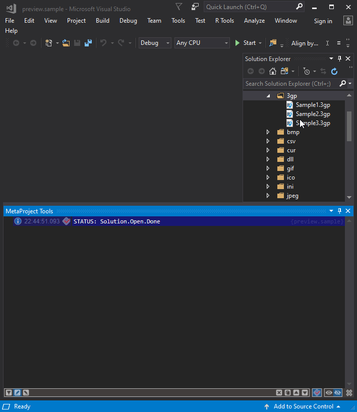

### Now you can look inside [3GP](https://en.wikipedia.org/wiki/3GP_and_3G2) and [3G2](https://en.wikipedia.org/wiki/3GP_and_3G2) file not opening it.
---

---
Download the extension from the [Visual Studio Marketplace](https://marketplace.visualstudio.com/items?itemName=ViacheslavLozinskyi.Preview-3GP)

---
Data visualization is based on [MetaProject](https://marketplace.visualstudio.com/items?itemName=ViacheslavLozinskyi.MetaProject)

Data extraction is based on [MetadataExtractor](https://github.com/drewnoakes/metadata-extractor-dotnet)